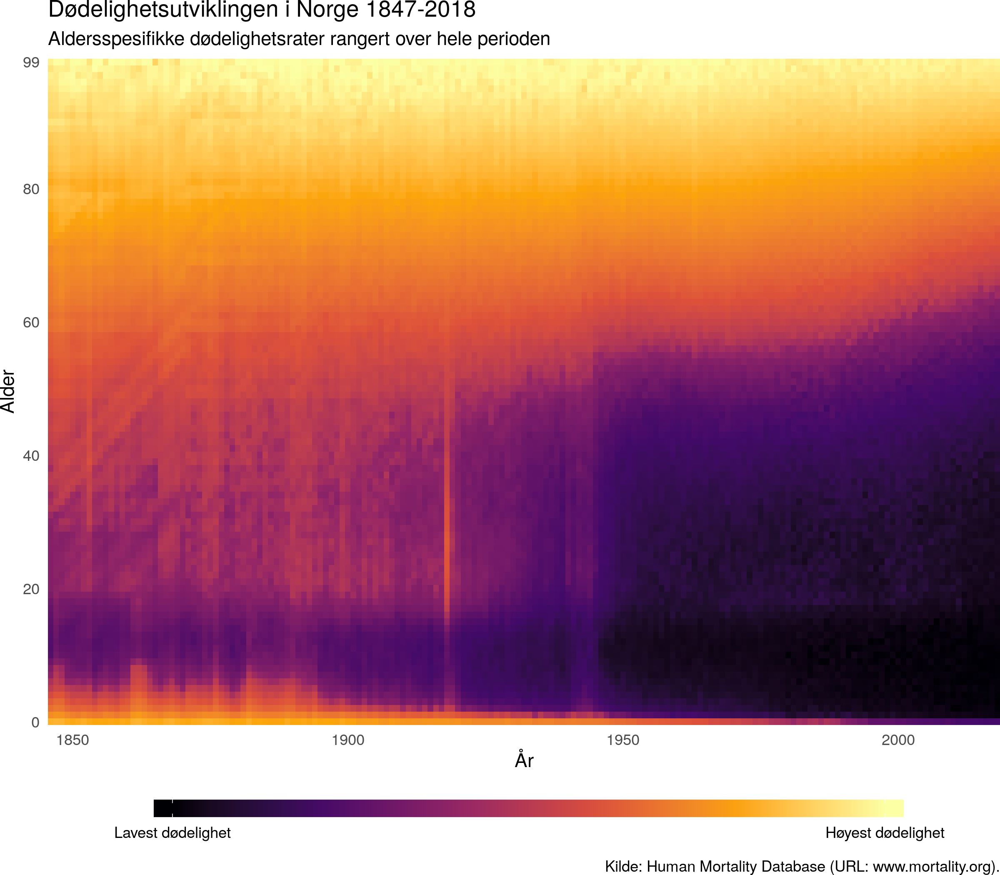

## Norsk dødelighet 1847-2018: Et visuelt minnesmerke om spanskesyken, den forrige pandemien.

Figuren viser dødelighetsrater beregnet for alle alderstrinn under 100 år for hvert år siden 1847. Ratene er rangert, og plottet som ruter med farge etter hvor høy dødeligheten var i den bestemte aldersgruppen det bestemte året. Lyse farger (lys gul) indikerer at raten er blant de høyeste i perioden som helhet, og mørke farger indikerer at raten er blant de laveste i perioden. Dataene kommer fra Human mortality database, den viktiste samledatabasen for dødelighetsdata, men er opprinnelig hentet fra historisk og nåtidig statistikk fremstilt av [Statistisk sentralbyrå](http://www.ssb.no).
 

 

Dødeligheten i Norge har sunket over lang tid og synker fortsatt. Om vi følger utviklingen over år ser noen viktige trekk: barnedødeligheten har sunket dramatisk, og er nesten borte. Midt i figuren, rundt 1918, lyser en vertikal linje opp. Disse årene var dødeligheten markant høyere enn både årene før og etter. Linjen er avtrykket av spanskesyken, den forrige store pandemien. Vi kan også skimte en jevnt over høyere dødelighet under okkupasjonen av Norge i 2. verdenskrig. Etterkrigstiden kjennetegnes av lavere dødelighet, som er med på å forme dagens samfunn med relativt mange eldre.

### Om Datapunkt

Datapunkt er en irregulær spalte i Transit magasin. Ansvarlig for spalten er [Torkild Hovde Lyngstad](https://torkildl.github.io). Bidrag og forslag kan sendes på [epost](mailto:t.h.lyngstad@sosgeo.uio.no). Programmer og datafiler for figurene ligger på spaltens [GitHub-lager](https://github.com/torkildl/transit). Bruk av enkelte av datakildene krever godkjenning av dataeier og er derfor ikke tilgjengelige på lageret.

